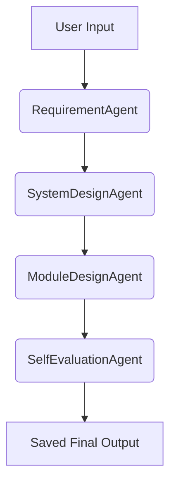

# 🧠 ADK-Free Multi-Agent Design System

This project is a fully refactored, dependency-free version of a multi-agent software design assistant.
It replaces Google ADK + LiteLLM with pure Python, and supports OpenAI or Ollama LLMs.

---

## 🚀 Features

- ✅ Modular agents: Requirements → System Design → Module Plan → Evaluation
- ✅ Shared `state` flow between agents
- ✅ CLI-first: No web UI, simple command line execution
- ✅ Logging with `logger`
- ✅ `pytest` test coverage for agents and pipeline
- ✅ Supports OpenAI or local Ollama backend
- ✅ Auto-save all results as JSON under `outputs/`
- ✅ Streamed LLM output support in CLI
- ✅ Markdown → Mermaid diagram rendering (coming soon)
- ✅ Self-check with eval agent (enabled)

---

## 📁 Project Structure

```bash
adk_multi_agent_project/
├── agents/
│   ├── requirement_agent/
│   ├── system_design_agent/
│   ├── module_design_agent/
│   └── self_eval_agent/
├── core/
│   ├── base_agent.py
│   ├── llm_api.py
│   └── config.py
├── utils/
│   └── save_state.py
├── workflows/
│   └── design_pipeline.py
├── tests/
│   ├── test_agents.py
│   └── test_pipeline.py
├── run.py
├── Dockerfile
├── requirements.txt
├── .gitignore
├── .env.example
└── README.md
```

---

## 🔁 Run with Docker

```bash
docker build -t multi-agent .
docker run --rm -it \
  -e OPENAI_API_KEY=sk-xxxx \
  -e USE_MODEL=openai \
  multi-agent
```

> 💡 For Ollama:
> ```bash
> docker run --rm -it \
>   -e USE_MODEL=ollama \
>   -e OLLAMA_BASE=http://host.docker.internal:11434 \
>   multi-agent
> ```

---

## 📦 Installation (Local)

```bash
git clone <this_repo>
cd adk_multi_agent_project
python -m venv .venv
source .venv/bin/activate
pip install -r requirements.txt
```

### Required Environment
Use `.env` or manually export:
```bash
OPENAI_API_KEY=sk-xxxx
USE_MODEL=openai   # or ollama
OLLAMA_BASE=http://localhost:11434
```

Use `.env.example` as a template:
```bash
cp .env.example .env
```

---

## ▶️ Running the System

```bash
python run.py
```
- System will prompt you for a design feature (e.g., Wi-Fi)
- Each agent runs sequentially with visible logging
- Final `state` is saved to `outputs/run_TIMESTAMP.json`

---

## 🔬 Testing with Pytest

Run all tests:
```bash
pytest
```

Includes:
- `test_agents.py`: Verifies each agent’s `process()` behavior
- `test_pipeline.py`: Validates complete execution and state integrity

---

## 🧠 Agents Summary

| Agent               | Purpose                                            |
|--------------------|----------------------------------------------------|
| RequirementAgent   | Parse user intent and extract SRS                  |
| SystemDesignAgent  | Build architecture plan from requirements          |
| ModuleDesignAgent  | Break architecture into modules & code stubs       |
| SelfEvaluationAgent| Review output and offer improvement suggestions    |

---

## 📊 Mermaid Diagram

Below is a Mermaid diagram that illustrates the V-model software engineering workflow implemented by this system:



---

## ✅ Improvements Implemented
- [x] Streaming output from OpenAI/Ollama via CLI
- [x] Markdown rendering enabled for `evaluation` section
- [x] Save agent state to timestamped JSON
- [x] Prompt modularization for clarity
- [x] Logging added to CLI and pipeline
- [x] .env.example and .gitignore included

---

## 📘 繁體中文版

👉 若您偏好閱讀繁體中文版本的說明文件，請參見：
[README.zh-TW.md](README.zh-TW.md)

---

## 💡 License
MIT — Free to modify, use and share

