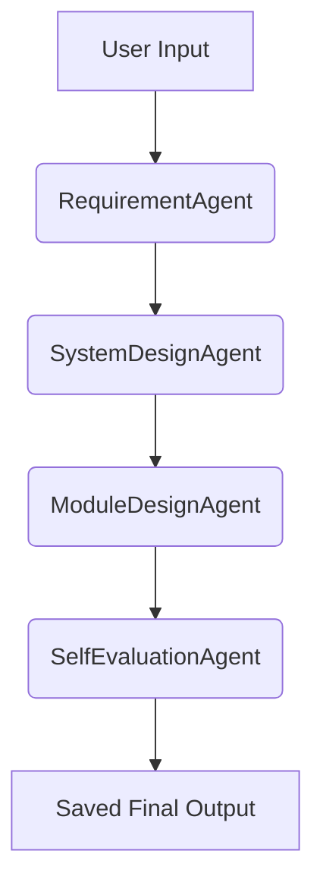

# 🧠 ADK-Free Multi-Agent Design System

This project is a fully refactored, dependency-free version of a multi-agent software design assistant.
It replaces Google ADK + LiteLLM with pure Python, and supports OpenAI or Ollama LLMs.

...

## 📊 Mermaid Diagram

Below is a Mermaid diagram that illustrates the V-model software engineering workflow implemented by this system:

...

## 💡 License
MIT — Free to modify, use and share
