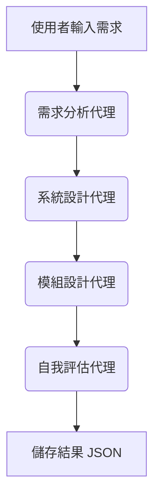

# 🧠 ADK-Free 多代理設計系統（繁體中文）

本專案是多代理軟體設計系統的重構版本，不依賴 Google ADK 或 LiteLLM，純使用 Python 編寫，支援 OpenAI 和本地端 Ollama 模型。

---

## 🚀 特色功能

- ✅ 模組化代理流程：需求分析 → 系統設計 → 模組設計 → 自我評估
- ✅ 多個代理共享 `state` 狀態資料
- ✅ CLI 命令列方式操作，無需 Web UI
- ✅ 使用 `logger` 進行日誌記錄
- ✅ 全面支援 `pytest` 單元測試
- ✅ 可切換 OpenAI 或 Ollama 模型
- ✅ 所有結果自動儲存至 `outputs/` 資料夾
- ✅ CLI 支援 LLM 輸出串流顯示
- ✅ 評估代理已啟用
- ✅ Mermaid 圖解呈現 V-model 工作流程

---

## 📁 專案結構

```bash
adk_multi_agent_project/
├── agents/
│   ├── requirement_agent/        # 需求分析代理
│   ├── system_design_agent/      # 系統設計代理
│   ├── module_design_agent/      # 模組設計代理
│   └── self_eval_agent/          # 自我評估代理
├── core/                         # 基礎類別與 API 呼叫模組
├── utils/                        # 儲存工具
├── workflows/                    # 管線設計流程
├── tests/                        # 測試程式
├── run.py                        # 主執行程式
├── Dockerfile
├── requirements.txt
├── .gitignore
├── .env.example
└── README.md
```

---

## 🔁 Docker 執行方式

```bash
docker build -t multi-agent .
docker run --rm -it \
  -e OPENAI_API_KEY=sk-xxxx \
  -e USE_MODEL=openai \
  multi-agent
```

若使用 Ollama：
```bash
docker run --rm -it \
  -e USE_MODEL=ollama \
  -e OLLAMA_BASE=http://host.docker.internal:11434 \
  multi-agent
```

---

## 📦 本地安裝方式

```bash
git clone <本專案網址>
cd adk_multi_agent_project
python -m venv .venv
source .venv/bin/activate
pip install -r requirements.txt
```

建立 `.env` 設定檔：
```bash
cp .env.example .env
```

---

## ▶️ 系統執行方式

```bash
python run.py
```

- 系統會要求你輸入設計需求（例如 Wi-Fi 傳輸）
- 所有代理依序執行並記錄 log
- 最終輸出結果會儲存至 `outputs/`

---

## 🔬 測試方式

執行全部測試：
```bash
pytest
```

包含：
- `test_agents.py`: 測試每個代理 `process()` 功能是否正確
- `test_pipeline.py`: 驗證整體流程是否成功與輸出格式完整

---

## 🧠 代理說明一覽

| 代理名稱             | 職責說明                                |
|----------------------|------------------------------------------|
| RequirementAgent     | 根據輸入產生 SRS 需求列表                |
| SystemDesignAgent    | 根據需求建立系統架構                    |
| ModuleDesignAgent    | 分解架構產出 C 語言函式原型               |
| SelfEvaluationAgent  | 檢查模組設計是否符合需求、提出建議        |

---

## 📊 Mermaid 流程圖（V-Model）



---

## ✅ 已實作功能摘要
- [x] CLI 串流輸出
- [x] Mermaid 圖文渲染
- [x] 儲存輸出狀態至 JSON
- [x] prompt 結構模組化
- [x] 日誌功能整合
- [x] 範例 `.env.example`、`.gitignore` 提供

---

## 📄 授權方式
MIT 開源授權，歡迎自由修改與使用。
